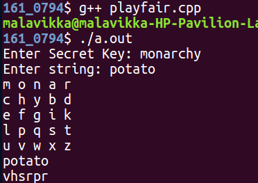
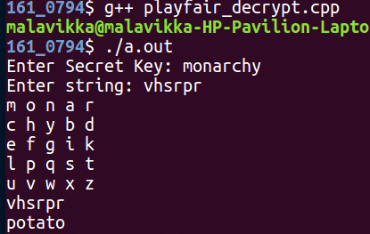

# Cryptography - Playfair cipher implementation

Playfair cipher is the most popular polyalphabetic cipher. It is a form of block cipher which has no limit on the number of characters in a message it can do, but it operates on block of characters encrypting two characters at a time cipher. In this, the plain text digrams are converted to cipher text digrams(pairs of letters) and vice versa using a pre-shared key. This is achieved by performing several operations column wise row wise and by creating rectangular form. The traditional 5 x 5 Playfair cipher supports twenty- five uppercase alphabets.

## Description
In traditional Playfair the position of I=J are incorporated into one square since English alphabets consist of 26 letters but in Playfair a matrix of 5X5 grid(also known as key-square) is made that is twenty five letters can only be embedded including keyword. For instance, if we select puzzle as the confidential keyword the matrix is as shown
			P U	Z	L	E
			A	B	C	D	F
			G	H	I	K	M
			N	O	Q	R	S
			T	V	W	X	Y
Then the message is wrecked up into digraphs or groups of two letters.If there is an odd number of letters, a Z is added to the last letter. Each letter can only be used once so further use of a letter is ignored leftover spaces are filled with the rest of the letters of the alphabet.
The encryption occurs depending on the following three principles. 
1. Just in case both the letters are in the same row, replace them with the letter on the right of the letter. If the letter is at the start, go to the next letter. 
2. Just in case both the letters are in the same column, replace them with the letter below them. If the letter is at the top, go to the bottom of the column and use the letter to replace with top letter. 
3. If neither of the alphabets lies in the same column nor same row, imagine creating a rectangle form and write the corners alphabets.

The decryption occurs depending on the following three principles. 
1. If both the letters are in the same row, Take the letter to the left of each one (going back to the rightmost if at the leftmost position). 
2. If both the letters are in the same column, Take the letter above each one (going back to the bottom if at the top). 
3. If neither of the alphabets lies in the same column nor same row, imagine creating a rectangle form and write the corners alphabets.

## Commands to run
### Encryption - 
``` 
$ g++ playfair.cpp
```
### Decryption - 
``` 
$ g++ playfair_decrypt.cpp
```

## Output
### Encryption - 
  
### Decryption - 
  
